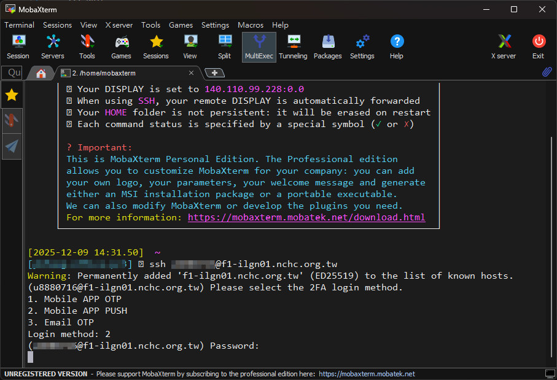
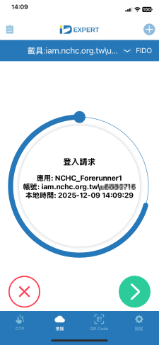
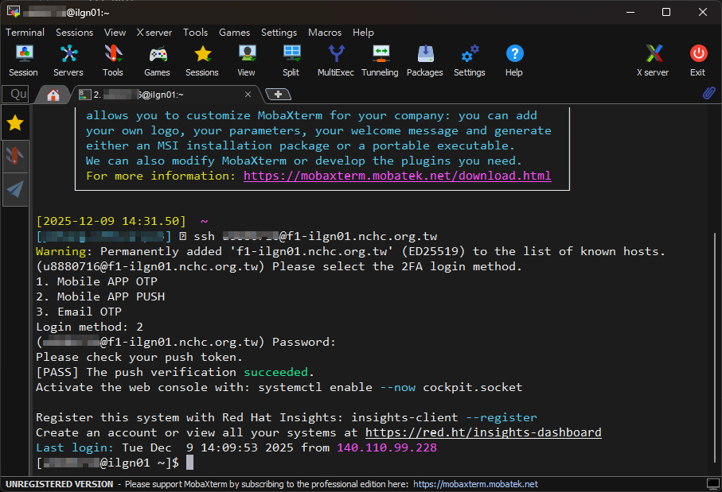

## 新手上路
1. 註冊帳號  
    a. 點選[iService](https://iservice.nchc.org.tw/nchc_service/index.php)網頁  
    b. 點選**註冊**  
    c. 以電子郵件作為會員帳號  
    d. 填寫會員資料與主機帳號   
    e. 收取 e-mail 認證信箱、收取簡訊認證手機號碼，即完成註冊  

    !!! NOTE   
        * [註冊帳號的說明1](https://iservice.nchc.org.tw/nchc_service/nchc_service_qa_single.php?qa_code=32)  
        * [註冊帳號的說明2](https://man.twcc.ai/@twccdocs/doc-service-main-zh/https%3A%2F%2Fman.twcc.ai%2F%40twccdocs%2Fguide-service-signup-zh)

2. [設定OTP載具](https://iservice.nchc.org.tw/nchc_service/nchc_service_qa_single.php?qa_code=774)  

    NCHC的超級電腦的登入方式採用二階段認證，第一個是主機帳號的密碼，第二個是OTP(One Time Password)。  

3. 登入主機，進行平行運算  
    a. 計畫代號，若無計畫，參閱[申請計畫](iservice.md) 
    b. 準備SSH連線軟體 ([MobaXterm](https://mobaxterm.mobatek.net/), [Putty](https://putty.org/index.html) for Windows, Terminal(終端機) for Linux/MacOS)  

#### **範例：用MobaXterm登入創進一號，執行平行運算程式，回傳節點和處理核心的序號(Rank)**  
1. 開啟MobaXterm，點選Start local terminal    
      
2. 輸入ssh指令  
    `ssh <user>@f1-ilgn01.nchc.org.tw`  
3. 選擇OPT方式，這裡選2，用手機執行IDExpert的推播。輸入主機帳號的密碼。  
      
4. 在手機上點選推播  
      
5. 完成登入創進一號節點  
      
6. 編輯`mpi_test.c`  
    ```c  
    #define _GNU_SOURCE  // 必須在所有 include 之前定義，以使用 sched_getcpu
    #include <stdio.h>
    #include <stdlib.h>
    #include <unistd.h>
    #include <mpi.h>
    #include <sched.h>   // 用於 sched_getcpu()

    int main(int argc, char** argv) {
        // 初始化 MPI 環境
        MPI_Init(&argc, &argv);

        // 取得總進程數 (Size) 與 當前進程編號 (Rank)
        int world_size;
        MPI_Comm_size(MPI_COMM_WORLD, &world_size);

        int world_rank;
        MPI_Comm_rank(MPI_COMM_WORLD, &world_rank);

        // 取得節點主機名稱 (Hostname)
        char hostname[256];
        gethostname(hostname, sizeof(hostname));

        // 取得當前運作的 CPU 核心編號
        // 注意：這是作業系統層級的 CPU ID (邏輯核心)
        int cpu_id = sched_getcpu();

        // 輸出資訊
        // 為了避免輸出混亂，通常只有 Rank 0 或者各自 print 但順序不保證
        // 這裡讓每個 Rank 都輸出，以便觀察分佈
        printf("MPI Rank: %03d | Host: %s | CPU_ID: %03d\n",
                world_rank, hostname, cpu_id);

        // 結束 MPI 環境
        MPI_Finalize();

        return 0;
    } 
    ```  
7. 編輯slurm腳本 `run_mpi.slurm`。`--account`是填寫計畫代號，紀錄運算資源與時間。`--nodes`是索取兩個節點，`--ntasks-per-node`是每個節點有兩個任務，`--cpus-per-task`是每個任務使用一個CPU核心。啟用Inte mpi compiler，編譯mpi_test.c並輸出mpi_test執行檔，執行mpi_test執行檔的平行運算。  
    ```shell
    #!/bin/bash
    #SBATCH --account=<ProjectID>      # (-A) iService Project ID
    #SBATCH --job-name=mpi_test        # (-J) Job name
    #SBATCH --partition=development    # (-p) Slurm partition
    #SBATCH --nodes=2                  # (-N) Maximum number of nodes to be allocated
    #SBATCH --cpus-per-task=1          # (-c) Number of cores per MPI task
    #SBATCH --ntasks-per-node=2        # Maximum number of tasks on each node
    #SBATCH --time=00:30:00            # (-t) Wall time limit (days-hrs:min:sec)
    #SBATCH --output=job-%j.out        # (-o) Path to the standard output file

    module purge
    module load intel/2024_01_46 # enable intel mpi compilier

    echo "Compiling code..."
    mpicc -o mpi_test mpi_test.c

    echo -e "\nExecuting mpi_test...\n"
    mpirun -np 4 ./mpi_test
    echo -e "\nJob finished."
    ```   
8. 執行腳本`sbatch run_mpi.slurm`，產生Job ID，觀察輸出結果。   
    ```shell
    [<user>@ilgn01 mpi_test]$ sbatch run_mpi.slurm
    Submitted batch job 565924
    [<user>@ilgn01 mpi_test]$ cat *565924*
    Compiling code...

    Executing mpi_test...

    MPI Rank: 000 | Host: icpnp152 | CPU_ID: 018
    MPI Rank: 001 | Host: icpnp152 | CPU_ID: 019
    MPI Rank: 002 | Host: icpnp153 | CPU_ID: 045
    MPI Rank: 003 | Host: icpnp153 | CPU_ID: 101

    Job finished.
    ```  

---
## 深入研究
完成第一次使用超級電腦，接下來更深入了解超級電腦的進階使用。
### 資料傳輸 
高速檔案系統(Hyper File Syetem, HFS)是超級電腦專用的儲存空間，可透過[FileZilla](https://filezilla-project.org/), [WinSCP](https://winscp.net/eng/download.php) 軟體與sftp指令傳輸資料從用戶電腦到HFS。   
[晶創25](https://man.twcc.ai/Yg_dk6n2T_-Y2Pmx3fXzAA)   
[創進一號](https://man.twcc.ai/@f1-manual/transport_ip)   
[台灣杉三號](https://man.twcc.ai/@TWCC-III-manual/SyGsFqRSt)  
[台灣杉二號](https://man.twcc.ai/@twccdocs/doc-hfs-main-zh/%2F%40twccdocs%2Fguide-hfs-connect-to-data-transfer-node-zh)   
*  高速檔案系統預設容量是100GB，若需增加容量可參閱[HFS容量設定](https://iservice.nchc.org.tw/nchc_service/nchc_service_qa_single.php?qa_code=768)。  
*  在Terminal介面查詢HFS容量。  
```shell
# 晶創25
[<user>@cbi-lgn01 ~]$ hfsquota
PATH            USED            HARD LIMIT       USAGE %  STATUS
home:/<user>  391347720192 B  1099511627776 B  35       ACTIVE

PATH            USED             HARD LIMIT        USAGE %  STATUS
work:/<user>  1794210246656 B  10995116277760 B  16       ACTIVE

# 單位換算 1099511627776 Byte / 1024 /1024 /1024 = 1024 GB

# 創進一號
[<user>@ilgn01 ~]$ mmlsquota -u $(whoami) --block-size auto home1 work1
                         Block Limits                                    |     File Limits
Filesystem type         blocks      quota      limit   in_doubt    grace |    files   quota    limit in_doubt    grace  Remarks
home1      USR          29.83G         1T     1.098T       320M     none |    43156       0        0       40     none
work1      USR          28.37G       100G       200G          0     none |       10       0        0        0     none

# 台灣杉二號
[<user>@un-ln01 ~]$ /usr/lpp/mmfs/bin/mmlsquota --block-size auto fs01 fs02
                         Block Limits                                    |     File Limits
Filesystem type         blocks      quota      limit   in_doubt    grace |    files   quota    limit in_doubt    grace  Remarks
fs01       USR          3.397T        20T      20.1T          0     none |  1427318       0        0        0     none NCHC_AIcls.twcc.ai
fs02       USR          185.5G        10T      10.1T       640M     none |    90181       0        0       40     none NCHC_AIcls.twcc.ai

# fs02是/home目錄，fs01是/work目錄
```   
### 圖形介面登入  
使用圖形介面軟體(ThinLinc)進入超級電腦，讀取運算輸出的圖形資料。  
[晶創25](https://man.twcc.ai/B5MmH5TiS6qwCKYZnP7HBw)   
[創進一號](https://man.twcc.ai/@f1-manual/thinlinc)  
[台灣杉三號](https://man.twcc.ai/@TWCC-III-manual/r1_eaoM2u)    
### Open OnDemand  
Open OnDemand 是一套開源的高效能運算（HPC）叢集網頁介面，提供使用者簡易且直觀的操作方式，無需透過複雜的命令列或 SSH 工具，即可進行叢集資源管理與應用程式操作。  
[創進一號:5.特殊工作節點操作流程](https://man.twcc.ai/@f1-manual/manual)   
### 查詢資源
查詢計畫錢包額度
```shell
[<user>@cbi-lgn01 ~]$ wallet <ProjectID>
PROJECT_ID: GOVxxxx32, PROJECT_NAME: NCHC-xxxxxxx-TWCC, SU_BALANCE: 482118.6382
```  
查詢Partition狀態，以晶創25為例  
```shell
[<user>@cbi-lgn01 ~]$ sinfo
PARTITION AVAIL  TIMELIMIT  NODES  STATE NODELIST
dev          up    2:00:00     10    mix hgpn[02-06,17-21]
normal       up 2-00:00:00     10    mix hgpn[02-06,17-21]
4nodes       up 1-00:00:00     10    mix hgpn[02-06,17-21]
normal2      up 2-00:00:00      8    mix hgpn[39-46]
```   

查詢節點有閒置的GPU，以下是晶創25有閒置GPU的節點  
```shell
[<user>@cbi-lgn01 ~]$ scontrol show node | grep -E 'NodeName|AllocTRES' | sed -n '/NodeName/{N; /gres\/gpu=8/!p}'
NodeName=hgpn02 Arch=x86_64 CoresPerSocket=56
   AllocTRES=cpu=32,mem=1400G,gres/gpu=7
NodeName=hgpn03 Arch=x86_64 CoresPerSocket=56
   AllocTRES=cpu=24,mem=800G,gres/gpu=4
NodeName=hgpn04 Arch=x86_64 CoresPerSocket=56
   AllocTRES=cpu=14,mem=1000G,gres/gpu=5
NodeName=hgpn06 Arch=x86_64 CoresPerSocket=56
   AllocTRES=cpu=13,mem=800G,gres/gpu=4
NodeName=hgpn19 Arch=x86_64 CoresPerSocket=56
   AllocTRES=cpu=9,mem=1200G,gres/gpu=6
NodeName=hgpn39 Arch=x86_64 CoresPerSocket=56
   AllocTRES=cpu=5,mem=200G,gres/gpu=1
NodeName=hgpn43 Arch=x86_64 CoresPerSocket=56
   AllocTRES=cpu=84,mem=1400G,gres/gpu=7
```  
### Miniconda
Miniconda是創建python虛擬環境的軟體，為不同專案創造獨立的虛擬環境，避免專案之間套件的版本衝突。  

#### **範例：在創進一號建立mpi4py的虛擬環境，引用虛擬環境執行python平行運算**  
1. 在登入節點命令列，新增名稱為mpi的虛擬環境  
    `conda create -n mpi python=3.10 -y`  
2. 查詢目前的虛擬環境  
    ```shell
    [user@ilgn01 ~]$ conda env list
    # conda environments:
    #
    mpi                      /home/user/.conda/envs/mpi
    base                     /pkg/tools/miniconda3
    ```  
3. 進入mpi虛擬環境，命令列前方出現虛擬環境名稱  
    ```shell
    [user@ilgn01 ~]$ conda activate mpi
    (mpi) [user@ilgn01 ~]$
    ```  
4. 虛擬環境初始化  
    `conda init`  
5. 安裝平行運算套件  
    `conda install -c conda-forge mpi4py -y`  
6. 退出虛擬環境  
    ```shell
    (mpi) [user@ilgn01 ~]$ conda deactivate
    [user@ilgn01 ~]$
    ```  
7. 編輯mpi程式mpi_test.py  
    ```python  
    from mpi4py import MPI
    import time
    import socket

    comm = MPI.COMM_WORLD
    rank = comm.Get_rank()
    size = comm.Get_size()
    hostname = socket.gethostname()

    start_time = time.time()

    # 各節點進行模擬運算
    time.sleep(2 + rank * 0.1)
    result = f"Rank {rank} on {hostname} finished task."

    # 收集所有節點結果
    results = comm.gather(result, root=0)

    end_time = time.time()

    if rank == 0:
        print("=== MPI 平行運算結果 ===")
        for r in results:
            print(r)
        print(f"總執行時間: {end_time - start_time:.2f} 秒 (共 {size} 個處理程序)")
    ```  
8. 編輯腳本mpi.slurm  
    ```shell
    #!/bin/bash
    #SBATCH --account=<Project_ID>       # (-A) iService Project ID
    #SBATCH --job-name=mpitest             # (-J) Job name
    #SBATCH --partition=development       # (-p) Slurm partition
    #SBATCH --nodes=2                     # (-N) Maximum number of nodes to be allocated
    #SBATCH --cpus-per-task=1             # (-c) Number of cores per MPI task
    #SBATCH --ntasks-per-node=2         # Maximum number of tasks on each node
    #SBATCH --time=00:30:00               # (-t) Wall time limit (days-hrs:min:sec)
    #SBATCH --output=%x_%j.out           # (-o) Path to the standard output file

    module purge
    module load tools/miniconda3

    conda activate mpi

    echo "SLURM_NODELIST=$SLURM_NODELIST"
    echo "SLURM_NTASKS=$SLURM_NTASKS"
    mpirun -np $SLURM_NTASKS python mpi_test.py
    ```  
9. 執行腳本
    ```shell
    [user@ilgn01 opensees]$ sbatch mpi.slurm
    Submitted batch job 608628
    [user@ilgn01 opensees]$ cat mpitest_608628.out
        Message from TWCC HPC admin
        -----------------------
        loading miniconda3 with conda 4.8.4/python 3.7
        docs : https://hackmd.io/@kmo/twcc_hpc_conda
        -----------------------

    SLURM_NODELIST=icpnp[126-127]
    SLURM_NTASKS=4
    === MPI 平行運算結果 ===
    Rank 0 on icpnp126 finished task.
    Rank 1 on icpnp126 finished task.
    Rank 2 on icpnp127 finished task.
    Rank 3 on icpnp127 finished task.
    總執行時間: 2.30 秒 (共 4 個處理程序)
    ```  

### Singularity容器
使用者無sudo權限，無法在超級電腦安裝軟體，可透過Singularity容器引用已安裝好或自行定義的開發環境。

#### **範例：登入晶創25主機，引用pytorch容器，執行Pytorch平行程式，回傳節點和GPU核心的序號(Rank)**  
1. 開啟MobaXterm，輸入ssh指令  
    `ssh <user>@nano5.nchc.org.tw`  
2. 編輯Pytorch程式[train_multi_gpu.py](getting-started/train_multi_gpu.py)   
    ```python
    import os
    import torch
    import torch.distributed as dist
    import argparse

    def main():
        # 1. 初始化分佈式環境
        # PyTorch 建議使用 'env://' 初始化，它會從環境變數 (如 Slurm 設置的) 自動獲取所需資訊。
        dist.init_process_group(backend="nccl")

        # 2. 獲取並輸出關鍵的分佈式資訊

        # 總體 (Global) Rank: 程式在所有節點/所有 GPU 中的唯一 ID (從 0 到 N-1)
        global_rank = dist.get_rank()

        # 世界大小 (World Size): 參與訓練的總進程/GPU 數量
        world_size = dist.get_world_size()

        # 節點 (Local) Rank: 程式在當前節點 (主機) 內的唯一 ID (從 0 到 G-1, G 為該節點 GPU 數)
        local_rank = int(os.environ.get("LOCAL_RANK", -1))

        # 當前節點的名稱 (Hostname)
        node_name = os.environ.get("SLURMD_NODENAME", "Unknown Node")

        # 獲取並設置當前進程應該使用的 GPU 設備
        if torch.cuda.is_available():
            # 設置設備為該進程的 local_rank 對應的 GPU
            # PyTorch DDP 和 Slurm/Torchrun 會確保 local_rank 正確對應到可用的 GPU
            device = torch.device(f"cuda:{local_rank}")
            torch.cuda.set_device(device)
            gpu_name = torch.cuda.get_device_name(device)
        else:
            device = torch.device("cpu")
            gpu_name = "N/A"

        # 輸出所需資訊
        print(f"--- Process Info ---")
        print(f"Node Name: {node_name}")
        print(f"Global Rank: {global_rank} / {world_size}")
        print(f"Local Rank (GPU Index on Node): {local_rank}")
        print(f"Using Device: {device} ({gpu_name})")

        # 3. 模擬訓練步驟 (可替換為您的實際模型和數據集)
        if global_rank == 0:
            print("\nStarting a mock training loop...")

        # 創建一個小型模型並將其移動到正確的設備
        model = torch.nn.Linear(10, 1).to(device)
        # 將模型包裹在 DDP 中
        ddp_model = torch.nn.parallel.DistributedDataParallel(model, device_ids=[local_rank] if torch.cuda.is_available() else None)

        # 模擬數據和訓練步驟
        data = torch.randn(2, 10).to(device)
        target = torch.randn(2, 1).to(device)
        loss_fn = torch.nn.MSELoss()
        optimizer = torch.optim.SGD(ddp_model.parameters(), lr=0.01)

        # 模擬一個訓練步驟
        output = ddp_model(data)
        loss = loss_fn(output, target)
        loss.backward()
        optimizer.step()

        # 確保所有進程都完成後再退出
        dist.barrier()

        if global_rank == 0:
            print("Mock training complete. All processes synchronized.")

        # 4. 清理分佈式環境
        dist.destroy_process_group()

    if __name__ == "__main__":
        main()
    ```   
3. 到[NVIDIA NGC Catalog](https://catalog.ngc.nvidia.com/orgs/nvidia/containers/pytorch)網頁，用Singularity指令下載Pytorch容器映像檔  
    ```shell
    singularity pull pytorch_24.05-py3.sif docker://nvcr.io/nvidia/pytorch:24.05-py3
    ```   
4. 編輯slurm腳本`run_ddp.slurm`，索取兩個節點，每個節點有兩個GPU，引用pytorch容器  
    ```shell
    #!/bin/bash
    #SBATCH -A <Project_ID>           # iService Project id
    #SBATCH -J ddp_test                # job name
    #SBATCH -p normal                # partition dev normal normal2
    #SBATCH --nodes=2              # Maximum number of nodes to be allocated
    #SBATCH --cpus-per-task=4      # Number of cores per MPI task
    #SBATCH --ntasks-per-node=1    # Number of MPI tasks (i.e. processes)
    #SBATCH --gres=gpu:2
    #SBATCH -o %x_%j.out          # Path to the standard output file
    #SBATCH -t 0-00:10:00

    export OMP_NUM_THREADS=1
    export MASTER_ADDR=$(scontrol show hostnames $SLURM_JOB_NODELIST | head -n 1)
    export MASTER_PORT=29500
    echo "Starting distributed job with MASTER_ADDR=$MASTER_ADDR and MASTER_PORT=$MASTER_PORT"

    SIF=/path/to/pytorch_24.05-py3.sif
    SINGULARITY="singularity run -B /work:/work --nv $SIF"

    CMD="torchrun \
        --nnodes $SLURM_NNODES \
        --nproc_per_node $SLURM_GPUS_ON_NODE \
        --rdzv_id $SLURM_JOB_ID \
        --rdzv_backend c10d \
        --rdzv_endpoint $MASTER_ADDR:$MASTER_PORT \
        train_multi_gpu.py"

    if [[ "$SLURM_NNODES" = 1 ]]; then
        RUN="$SINGULARITY $CMD" # for one node
    else
        RUN="srun --nodes=$SLURM_NNODES --ntasks=$SLURM_NNODES $SINGULARITY $CMD" # for multi nodes
    fi

    echo "$RUN"; $RUN
    echo -e "\nJob finished.\n"
    ```           
5. 執行腳本`sbatch run_ddp.slurm`，產生Job ID，觀察輸出結果。  
    ```Shell
    [<user>@cbi-lgn01 pytorch_test]$ sbatch run_ddp.slurm
    Submitted batch job 78728
    [<user>@cbi-lgn01 pytorch_test]$ cat *78728*
    Starting distributed job with MASTER_ADDR=hgpn02 and MASTER_PORT=29500
    srun --ntasks=2 --nodes=2 singularity run -B /work:/work --nv /work/user/sif/pytorch_24.05-py3.sif torchrun  --nnodes 2  --nproc_per_node 2  --rdzv_id 78728  --rdzv_backend c10d  --rdzv_endpoint hgpn02:29500  train_multi_gpu.py

    ....容器啟動訊息...

    --- Process Info ---
    Node Name: hgpn02
    Global Rank: 0 / 4
    Local Rank (GPU Index on Node): 0
    Using Device: cuda:0 (NVIDIA H100 80GB HBM3)

    Starting a mock training loop...
    --- Process Info ---
    Node Name: hgpn03
    Global Rank: 2 / 4
    Local Rank (GPU Index on Node): 0
    Using Device: cuda:0 (NVIDIA H100 80GB HBM3)
    --- Process Info ---
    Node Name: hgpn02
    Global Rank: 1 / 4
    Local Rank (GPU Index on Node): 1
    Using Device: cuda:1 (NVIDIA H100 80GB HBM3)
    --- Process Info ---
    Node Name: hgpn03
    Global Rank: 3 / 4
    Local Rank (GPU Index on Node): 1
    Using Device: cuda:1 (NVIDIA H100 80GB HBM3)
    Mock training complete. All processes synchronized.

    Job finished.
    ```  

