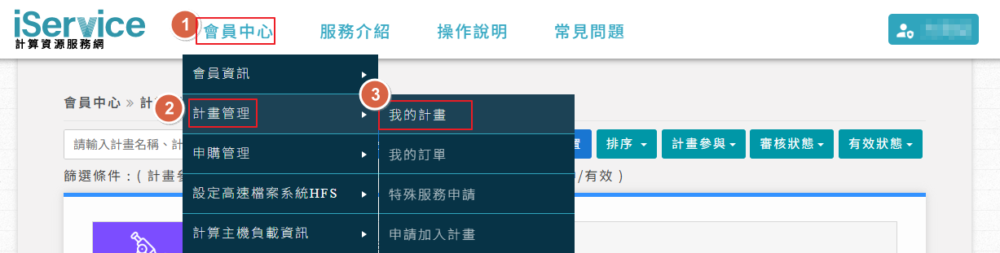

# [iService](https://iservice.nchc.org.tw/nchc_service/index.php)
# 計畫管理者具有以下功能的權限
- [申請計畫](https://iservice.nchc.org.tw/nchc_service/nchc_service_qa_single.php?qa_code=23)
    1. 點選**會員中心**>**計劃管理**>**我的計畫**
    
    2. 點選**新增**
    

    - [國科會計畫](https://iservice.nchc.org.tw/nchc_service/nchc_service_qa_single.php?qa_code=101)
    - [學術計畫](https://iservice.nchc.org.tw/nchc_service/nchc_service_qa_single.php?qa_code=104)
    - [政府與法人計畫](https://iservice.nchc.org.tw/nchc_service/nchc_service_qa_single.php?qa_code=107)
    - [企業與個人計畫](https://iservice.nchc.org.tw/nchc_service/nchc_service_qa_single.php?qa_code=300)

- [加入計畫成員](https://iservice.nchc.org.tw/nchc_service/nchc_service_qa_single.php?qa_code=23)
- [設定成員的子錢包](https://iservice.nchc.org.tw/nchc_service/nchc_service_qa_single.php?qa_code=20)
- [設定成員為管理員](https://iservice.nchc.org.tw/nchc_service/nchc_service_qa_single.php?qa_code=25)
- [HFS容量設定](https://iservice.nchc.org.tw/nchc_service/nchc_service_qa_single.php?qa_code=768)